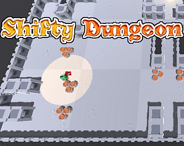
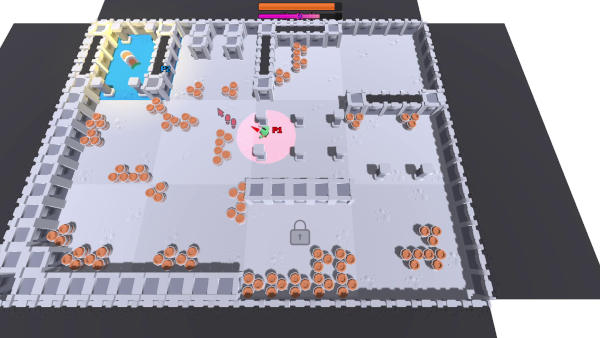
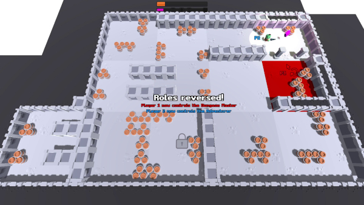
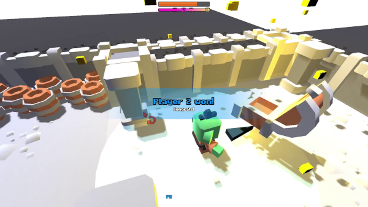

# Shifty Dungeon

A game originally made for the [GMTK GameJam 2023](https://itch.io/jam/gmtk-2023)
for the theme "Roles Reversed".

It is kind of a classic Adventurer searches for the Treasure game with
two twists: the Dugneon Master rotates the tiles, and the role of the
Adventurer and the DM swaps during gameplay.

## The jam version

Checkout the (barely playable) entry: https://gheja.itch.io/shifty-dungeon

The jam was 48 hours long however my entry was made in about 10 hours.
This is my second game made in Godot and although the entry is far from
what I really wanted to deliver I learned a lot of new things (navmeshes,
dynamic navmeshes, pathfinding, handling 3D models, building blocks with
them, etc.), so overall I am happy that I participated.

The jam had a *lot* of strong entries, I was genuinely surprised it
ranked right around the middle. (For Creativity it ranked in the top
25% - I'm grateful for the people seeing the potential.)

## The latest version

After submitting the entry I kept working on the game, fixing the bugs,
implementing my ideas, etc.

Checkout the latest version: https://gheja.itch.io/shifty-dungeon-latest

Gameplay: https://www.youtube.com/watch?v=4Tzgzvp-GzA

Screenshots:

## Credits

The jam rules stated: "The game should be developed during the jam, but
you may use pre-existing code and can use whatever art and audio assets
you have the legal right to use."

I decided to go with only publicly available royalty free assets.

For a detailed list of files and the licenses see: [licenses.md](licenses.md)

Code, additional graphics: Gabor Heja

Graphics: Kenney (kenney.nl)

Icons: Orchid, Jordan Hughes and SVG Repo (via svgrepo.com)

Font: Eeve Somepx (somepx.itch.io)

Music: Psychronic (via pixabay.com)

Sounds: Kenney (kenney.nl)

Logo: made with cooltext.com
